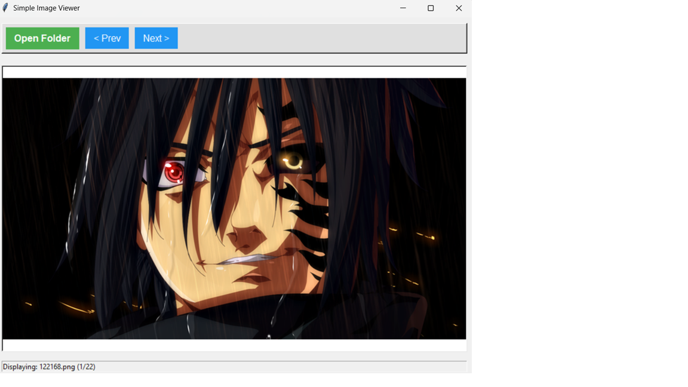

## Simple Tkinter Image Viewer
This is a basic desktop application built using Python's Tkinter library and the Pillow (PIL) library. It allows users to browse through image files within a selected directory, displaying them with automatic resizing to fit the window.

## Features
Browse Directories: Easily select a folder containing your images.

Image Navigation: Navigate between images using "Previous" and "Next" buttons.

Supported Formats: Supports common image formats like PNG, JPG, JPEG, GIF, BMP, and TIFF.

Responsive Display: Images are automatically resized to fit the viewer window, and they scale dynamically when the window is resized.

User Feedback: A status bar displays the currently viewed image file name and its position in the sequence.

Error Handling: Basic error handling for missing files or issues during image loading.

## Prerequisites
Before running the application, ensure you have Python installed (Python 3.x is recommended). You will also need the Pillow library, which is a fork of the Python Imaging Library (PIL).

You can install Pillow using pip:

pip install Pillow

## Project Structure
It's recommended to organize your project as follows:

image_viewer_project/
├── image_viewer_app.py   # The main application code
├── images/               # (Optional) A folder for sample images
│   ├── image1.png
│   ├── image2.jpg
│   └── ...
└── README.md             # This file

How to Run
Save the Code: Save the provided Python code (from the tkinter-image-viewer Canvas) into a file named image_viewer_app.py within your project directory.

Install Dependencies: If you haven't already, install the Pillow library:

pip install Pillow

Execute the Application: Open a terminal or command prompt, navigate to your image_viewer_project/ directory, and run the script:

python image_viewer_app.py

## Usage
Launch the App: Run the image_viewer_app.py script.

Open Folder: Click the "Open Folder" button. A file dialog will appear.

Select Directory: Navigate to the directory containing your images and select it.

View Images: The first supported image in the selected folder will be displayed.

Navigate: Use the "< Prev" and "Next >" buttons to move through the images. These buttons will be enabled only if there is more than one image in the folder.

Resize Window: Try resizing the application window; the image will adjust its size to fit the new dimensions.

## Troubleshooting
"Pillow library not found." error: Make sure you have installed Pillow using pip install Pillow.

"No Images Found" message: Verify that the selected directory actually contains image files with supported extensions (.png, .jpg, .jpeg, .gif, .bmp, .tiff).

Image not displaying correctly: Ensure the image file is not corrupted. Some very large images might take a moment to load or could cause memory issues on systems with limited RAM.

Feel free to modify and enhance this image viewer!

## Screenshots

