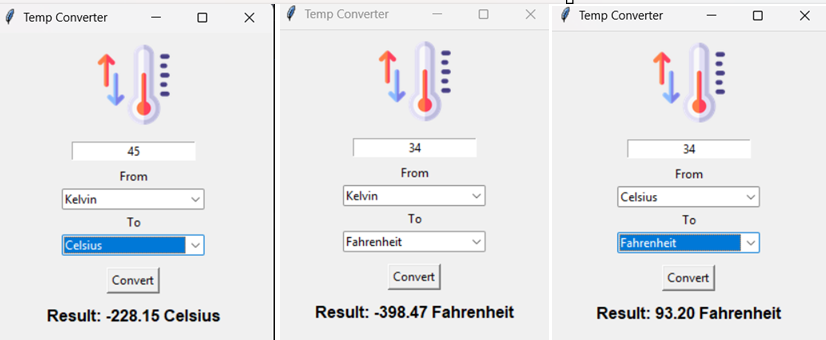

# 🌡️ Simple Temperature Converter - Tkinter

A lightweight, user-friendly temperature converter built using Python's Tkinter GUI framework.  
It allows conversions between **Celsius**, **Fahrenheit**, and **Kelvin**, with optional icon display.

---

## 📸 Preview

---

## 🛠️ Features

- ✅ Convert temperatures between Celsius, Fahrenheit, and Kelvin.
- ✅ Clean and simple UI with dropdowns and buttons.
- ✅ Optional temperature icon (displayed if present).
- ✅ Input validation with error handling.
- ✅ No external dependencies except `Pillow` for image support.

---

## 🚀 Getting Started

### Prerequisites

- Python 3.7+
- [Pillow](https://pypi.org/project/Pillow/) (for image handling)

