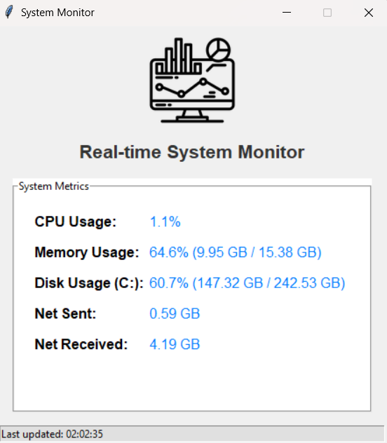

## Tkinter System Monitor
This is a simple desktop application built using Python's Tkinter library that provides real-time monitoring of your system's CPU, memory, disk, and network activity. The application is designed with a modular approach, separating the system data fetching logic from the graphical user interface.

## Features
Real-time Monitoring: Displays live updates of CPU usage, memory utilization, disk space, and network data (bytes sent and received).

#### 1 -Intuitive GUI: A clean and straightforward user interface built with Tkinter.

#### 2 - Application Icon: Features a custom icon at the top of the application window for better visual identity.

#### 3 - Modular Design: System metric fetching logic (system_metrics.py) is separated from the UI (system_monitor_app.py), enhancing code organization and reusability.

#### 4 - Status Bar: Provides real-time feedback on when the metrics were last updated.

#### 5 - Error Handling: Basic error handling for missing libraries or issues during metric retrieval.

## Prerequisites
This application requires Python 3.x. You will also need the following external Python libraries:

psutil: For accessing system details (CPU, memory, disk, network).

Pillow (PIL Fork): For handling image loading and resizing for the application icon.

You can install these libraries using pip:

pip install psutil Pillow

## Project Structure
To run this application, organize your files in the following structure:

my_system_monitor/
├── system_monitor_app.py   # The main Tkinter GUI application
├── system_metrics.py       # Contains functions for fetching system data
├── resources/              # Folder for application assets
│   └── monitor_icon.png    # Your application icon image (e.g., 100x100 pixels)
└── README.md               # This file

Note: Ensure that monitor_icon.png exists in the resources folder. If it's missing, the application will show a warning and a placeholder text instead of the icon.

## How to Run
Save the Code:

Save the code for the main GUI (from the tkinter-system-monitor immersive, specifically system_monitor_app.py) as system_monitor_app.py.

Save the system metrics logic code (from the system-metrics-logic immersive) as system_metrics.py.

Place both Python files in the same directory (e.g., my_system_monitor/).

Create Resources Folder: Inside your project directory (my_system_monitor/), create a new folder named resources.

Add Icon: Place your application icon image (e.g., monitor_icon.png) inside the resources folder.

Install Dependencies: If you haven't already, install psutil and Pillow:

pip install psutil Pillow

Execute the Application:
Open a terminal or command prompt, navigate to your my_system_monitor/ directory, and run the main application script:

python system_monitor_app.py

## Usage
Once the application is running, it will automatically start displaying real-time updates for:

#### CPU Usage: Percentage of CPU currently being used.

#### Memory Usage: Percentage of RAM used, along with used and total GB.

#### Disk Usage: Percentage of disk space used for the primary partition (C: on Windows, / on Linux/macOS), along with used and total GB.

#### Network Activity: Total bytes sent and received since the system started, displayed in GB.

The status bar at the bottom will indicate the time of the last update.

Troubleshooting
ModuleNotFoundError: No module named 'psutil' or No module named 'PIL':

Ensure you have installed psutil and Pillow using pip install psutil Pillow.

ModuleNotFoundError: No module named 'system_metrics':

Verify that system_metrics.py is in the same directory as system_monitor_app.py.

Icon not showing:

Check that monitor_icon.png is correctly placed inside the resources folder within your project directory.

Ensure the image file is not corrupted.

"Error updating metrics" in status bar:

This indicates an issue with fetching system data. Check your console for more specific error messages, which might point to OS-specific permission issues or unexpected psutil behavior.

## Screenshots

